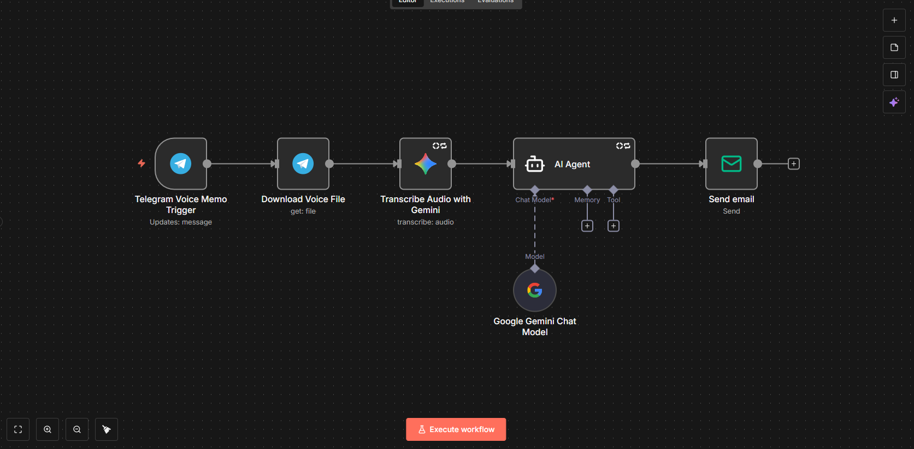
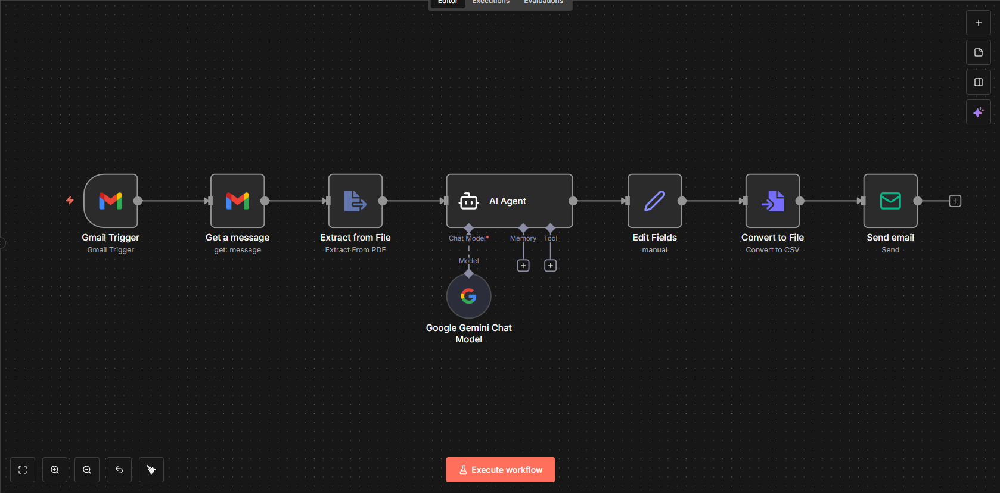

# n8n Automations

Sammlung von n8n-Workflows für Dokumentenverarbeitung und Kommunikationsautomatisierung.

---

## 1. Telegram Voice Memo → E-Mail

Sprachnachricht an einen Telegram-Bot schicken — Gemini transkribiert sie, formuliert daraus eine professionelle E-Mail, versendet sie per SMTP und bestätigt den Versand im Chat.



### Ablauf

```
Telegram Trigger
  └─ Absender prüfen          (fremde Chat-ID → stiller Abbruch)
       └─ Ist Sprachnachricht?
            └─ Voice-Datei laden
                 └─ Transkription (Gemini 2.5 Flash)
                      └─ Transkript brauchbar?
                           └─ E-Mail formulieren (Gemini Agent)
                                └─ E-Mail senden (SMTP)
                                     └─ Bestätigung im Chat

            Jeder Fehler-Ausgang → Fehlermeldung an Nutzer
```

### Benötigte Credentials

| Credential | Wo eintragen |
|---|---|
| Telegram Bot Token | Nodes: Trigger, Download, Bestätigung, Fehlermeldung |
| Google Gemini API Key | Nodes: Transkription, Chat Model |
| SMTP-Zugangsdaten | Node: E-Mail senden |

n8n-Variablen (Settings → Variables):

```
ALLOWED_CHAT_ID    Deine Telegram Chat-ID
MAIL_FROM          Absenderadresse
MAIL_TO            Empfängeradresse
```

### Import

1. n8n öffnen → Workflows → Import from File → `telegram-voice-to-email/workflow.json`
2. Jeden Node öffnen und eigene Credentials zuweisen
3. Variablen setzen
4. Workflow aktivieren und mit einer Sprachnachricht testen

### Warum 11 statt 6 Nodes

Die naive Version funktioniert im Testfall und bricht im Alltag:

- **Absender prüfen** — ohne diesen Check kann jeder mit der Bot-ID E-Mails über deinen SMTP-Account auslösen
- **Ist Sprachnachricht?** — bei Textnachrichten ist `voice.file_id` undefined, der Download schlägt fehl
- **Transkript brauchbar?** — leeres Transkript führt sonst dazu dass der Agent eine Mail aus dem Nichts erfindet
- **`alwaysOutputData: false`** — mit `true` läuft nach fehlgeschlagenen Retries ein leeres Objekt weiter
- **Fehlerpfad** — ohne ihn scheitert der Workflow still und der Nutzer wartet auf eine Mail die nie kommt

### Bekannte Grenzen

- Nur ein erlaubter Absender — für mehrere wäre eine Whitelist nötig
- Kein Rate Limit — wer autorisiert ist kann beliebig viele Mails auslösen
- Empfänger ist fest konfiguriert, wird nicht aus der Spracheingabe abgeleitet
- Gemini-Transkription ist bei Dialekt und Hintergrundgeräuschen fehleranfällig

---

## 2. KAP Invoice Extractor

Gmail auf neue Mails mit KAP-PDF-Anhang überwachen — PDF-Text automatisch extrahieren, alle steuerrelevanten Felder per Gemini auslesen und strukturiert als CSV zurücksenden.



### Ablauf

```
Gmail Trigger (pollt jede Minute)
  └─ Get a message (lädt PDF-Anhang herunter)
       └─ Extract from File (PDF → Text)
            └─ AI Agent (Gemini liest Felder als JSON)
                 └─ Edit Fields (JSON-Felder einzeln mappen)
                      └─ Convert to File (→ CSV)
                           └─ E-Mail senden (CSV als Anhang)
```

### Extrahierte Felder

| Feld | Beschreibung |
|---|---|
| Hoehe_der_Kapitalertraege | Gesamthöhe der Kapitalerträge |
| Gewinn_Aktienveraeusserungen | Gewinn aus Aktienverkäufen |
| Gewinn_AltAnteile | Gewinn aus Altanteilen |
| Ersatzbemessungsgrundlage | Ersatzbemessungsgrundlage |
| Sparer_Pauschbetrages | Angerechneter Sparer-Pauschbetrag |
| Kapitalertragsteuer | Einbehaltene Kapitalertragsteuer |
| Solidaritaetszuschlag | Einbehaltener Solidaritätszuschlag |
| Kirchensteuer_zur_Kapitalsteuer_Evangelisch | Kirchensteuer (ev.) |
| Kirchensteuer_zur_Kapitalsteuer | Kirchensteuer gesamt |
| Summe_angerechnete_auslaendische_Steuer | Angerechnete ausländische Steuer |
| Summe_anrechenbare_nicht_angerechnete_auslaendische_Steuer | Noch nicht angerechnete ausländische Steuer |

### Benötigte Credentials

| Credential | Wo eintragen |
|---|---|
| Gmail OAuth2 | Nodes: Gmail Trigger, Get a message |
| Google Gemini API Key | Nodes: AI Agent, Chat Model |
| SMTP-Zugangsdaten | Node: E-Mail senden |

n8n-Variablen (Settings → Variables):

```
MAIL_FROM    Absenderadresse
MAIL_TO      Empfängeradresse
```

### Import

1. n8n öffnen → Workflows → Import from File → `kap-invoice-extractor/workflow.json`
2. Jeden Node öffnen und eigene Credentials zuweisen
3. Variablen setzen
4. Workflow aktivieren und mit einer Test-Mail mit KAP-PDF testen

### Bekannte Grenzen

- Erwartet den PDF-Anhang als erstes Attachment (`attachment_0`) — Mails mit mehreren Anhängen oder ohne Anhang schlagen fehl
- Kein Fehlerpfad — bei Extraktionsfehler läuft ein leeres JSON weiter ohne Benachrichtigung
- Ausgelegt auf das Format deutscher Jahressteuerbescheinigungen — andere Formate liefern möglicherweise null-Werte
